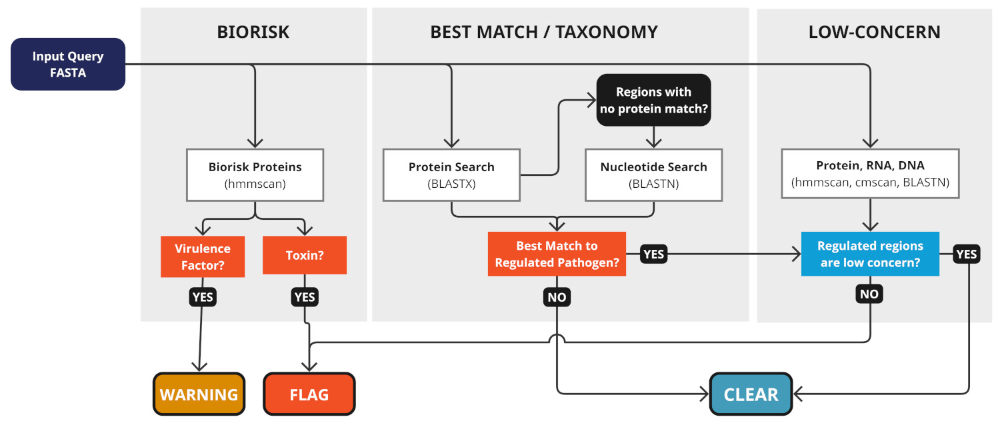

# commec: a free, open-source, globally available tool for DNA sequence screening

<picture style="max-width: 512; display: inline-block;">
	<source media="(prefers-color-scheme: dark)" srcset="https://ibbis.bio/wp-content/uploads/2025/06/COMMEC_Logo_Horiz_Color_IBBIS_onDark.png">
	
</picture>

The `commec` package is a tool for DNA sequence screening that is part of the
[Common Mechanism for DNA Synthesis screening](https://ibbis.bio/common-mechanism/). The package offers several sub-commands through the `commec` entrypoint:

    setup   Download or update the reference databases required for screening
    screen  Run Common Mechanism screening on an input FASTA.
    flag    Parse .screen or .json files in a directory and create CSVs of flags raised
    list    Display information on available annotated control lists

The `commec screen` command runs an input FASTA through the following screening steps:

1. **Biorisk search**: Fast HMM-based search against curated sequence profiles
2. **Best Match / Taxonomy Search**: look for best matches to regulated pathogens using a two-step process:
   * **Protein search**: BLASTX search against custom-filtered UniRef clusters
   * **Nucleotide search**: BLASTN search against curated viral reference genomes
3. **Low concern search**: Clear earlier flags based on matches to common or conserved sequences



The [GitHub Wiki](https://github.com/ibbis-screening/common-mechanism/wiki) has documentation for this package, including information about installing `commec` and interpreting screening results.

More information about the Common Mechanism project is available on the [commec.ibbis.bio](https://commec.ibbis.bio/) and [IBBIS project page](https://ibbis.bio/common-mechanism/).

## Quick start
`commec` and its package dependencies are installed via conda. The reference databases that support screening are downloaded and kept up to date with the `commec setup` command, which retrieves them from [databases.commec.io](https://databases.commec.io).

Once installed, download the reference databases and screen a FASTA file with:

```
commec setup -d /path/to/databases
commec screen -d /path/to/databases input.fasta
```

See the [GitHub Wiki](https://github.com/ibbis-screening/common-mechanism/wiki) for full installation instructions.


## Development
The `commec` package is being actively developed by IBBIS staff. We welcome contributions! To get started, install conda, and make sure
that [your channels are configured correctly](http://bioconda.github.io/). Then create the dev environment with:

```
conda env create -f environment.yaml
conda activate commec-dev
```

From here, you should have an interactive version of the package installed via `pip -e .` and the necessary shell dependencies.

## License
`commec` is released under the [MIT License](LICENSE).
